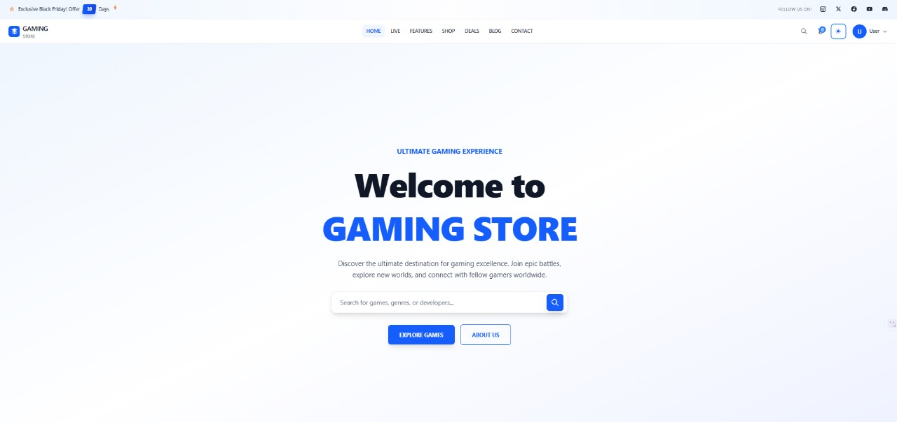

# 🎮 Gaming Store - React Gaming Marketplace

A modern, responsive gaming marketplace built with React that allows users to discover, browse, and purchase games with a beautiful dark/light theme interface.

## 🌐 Live Demo

**[View Live Demo](https://alx-fe-graduation-project-gaming-st.vercel.app/)**




## ✨ Key Features

### 🎮 **Core Functionality**
- **Game Discovery**: Browse extensive game collection with search and filters
- **Shopping Cart**: Add games to cart with real-time updates
- **User Authentication**: Secure login/registration system
- **Responsive Design**: Works perfectly on all devices
- **Theme Toggle**: Switch between light and dark modes

### 🔧 **Technical Features**
- **Modern React**: Built with React 18 and functional components
- **State Management**: React Context API for global state
- **Routing**: React Router for smooth navigation
- **Styling**: Tailwind CSS for modern, responsive design
- **API Integration**: 
  - **RAWG API** - For fetching comprehensive game data (used in Shop page)
  - **CheapShark API** - For fetching game deals and discounts (used in Deals page)

## 🚀 Getting Started

### Prerequisites
- Node.js (version 16 or higher)
- npm or yarn package manager

### Installation

1. **Clone the repository**
   ```bash
   git clone https://github.com/yourusername/alx-FE-graduation-project-gaming-store.git
   cd alx-FE-graduation-project-gaming-store
   ```

2. **Install dependencies**
   ```bash
   npm install
   # or
   yarn install
   ```

3. **Start development server**
   ```bash
   npm run dev
   # or
   yarn dev
   ```

4. **Open your browser**
   Navigate to `http://localhost:5000` to view the application

### Build for Production

```bash
npm run build
# or
yarn build
```

## 🛠️ Tech Stack

- **Frontend**: React 18, Vite
- **Styling**: Tailwind CSS
- **State Management**: React Context API, Zustand
- **HTTP Client**: Axios
- **Routing**: React Router DOM
- **APIs**: 
  - **RAWG API** - Game data and information
  - **CheapShark API** - Game deals and pricing
- **Testing**: Jest, React Testing Library
- **Code Quality**: ESLint, Prettier

## 🔌 API Integrations

### **RAWG API** 🎮
- **Purpose**: Fetch comprehensive game data including titles, descriptions, ratings, genres, and platforms
- **Implementation**: Used in the **Shop page** (`/games`) to display the main game catalog
- **Features**: Game search, filtering by genre/platform, detailed game information

### **CheapShark API** 💰
- **Purpose**: Fetch game deals, discounts, and pricing information from multiple retailers
- **Implementation**: Used in the **Deals page** (`/deals`) to showcase special offers and price drops
- **Features**: Deal tracking, price comparison, discount notifications

## 📁 Project Structure

```
src/
├── components/          # Reusable UI components
│   ├── Auth/          # Authentication components
│   ├── Header/        # Navigation components
│   ├── Footer/        # Footer component
│   └── Store/         # Store-related components
├── context/            # React Context providers
├── hooks/              # Custom React hooks
├── pages/              # Main page components
├── services/           # API services
└── stores/             # State management stores
```

## 🎯 Features to Implement

### 🔴 **High Priority**
- [x] **Game Search & Filtering**: Advanced search with genre, platform, price filters
- [x] **Shopping Cart**: Add/remove games, quantity management
- [x] **User Authentication**: Login, registration, profile management
- [x] **Game Details**: Comprehensive game information pages
- [x] **Responsive Design**: Mobile-first approach
- [x] **API Integration**: 
  - **RAWG API** integration for game data (Shop page)
  - **CheapShark API** integration for deals (Deals page)

### 🟡 **Medium Priority**
- [x] **Wishlist**: Save games for later (Add to favorites feature implemented)
- [ ] **Game Reviews**: User ratings and comments
- [ ] **Checkout Process**: Payment integration
- [ ] **Order History**: Track previous purchases
- [ ] **Admin Panel**: Manage games and users

### 🟢 **Low Priority**
- [ ] **Social Features**: Share games, follow friends
- [ ] **Game Recommendations**: AI-powered suggestions
- [ ] **Multi-language Support**: Internationalization
- [ ] **Push Notifications**: Price alerts, new releases
- [ ] **Offline Support**: PWA capabilities

## 🧪 Testing

```bash
# Run tests
npm test

# Run tests with coverage
npm run test:coverage

# Run tests in watch mode
npm run test:watch
```

## 📦 Available Scripts

- `npm run dev` - Start development server
- `npm run build` - Build for production
- `npm run preview` - Preview production build
- `npm run lint` - Run ESLint
- `npm run format` - Format code with Prettier


## 📸 Screenshots

### Homepage - Light Theme


### Homepage - Dark Theme  


### Game Store Section


### Game Details


## 📞 Contact

- **Project Link**: [https://github.com/yourusername/alx-FE-graduation-project-gaming-store](https://github.com/yourusername/alx-FE-graduation-project-gaming-store)
- **Live Demo**: [https://alx-fe-graduation-project-gaming-st.vercel.app/](https://alx-fe-graduation-project-gaming-st.vercel.app/)

---

⭐ **Star this repository if you find it helpful!**